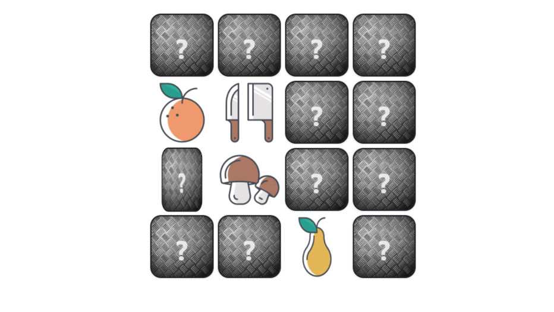
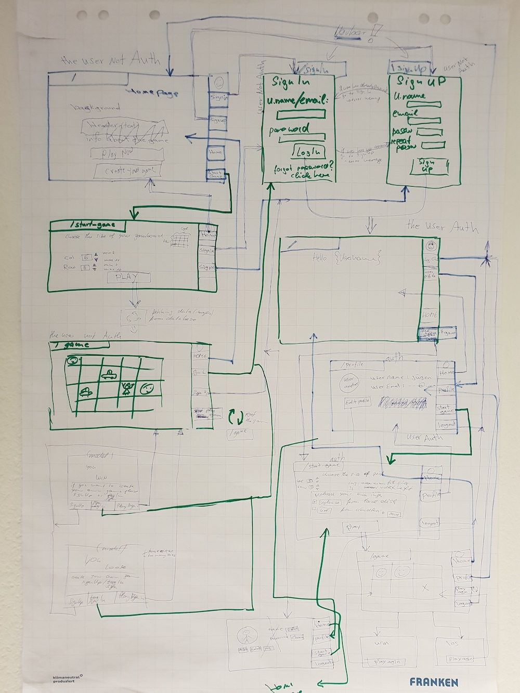

## Memory Game (MERN full stack app)

#### The backend repository
[The backend repository on github](https://github.com/Bierwurst/memory-game-backend-juergen)





### Our Wireframe 


> A memory game. Find 2 matching cards. You can play the default version, or create your personal game by uploading your own images.

> This is a group final project which was undertaken as part of the requirement for the completion of a 12 months Web Development course at the Digital Career Institute, Berlin. 


## See it live

[Memory Game live on firebase platform](https://memory-game-fb235.firebaseapp.com/)

## Quick Start

```bash
# Install dependencies for server
npm install

# Install dependencies for client
npm run client-install

# Run the client & server with concurrently
npm run dev

# Run the Express server only
npm run server

# Run the React client only
npm run client

# Server runs on http://localhost:5000 and client on http://localhost:3000
```


## App Info

### Team Members


Jürgen Schuler Web Developer
[juergens-website](https://bierwurst.github.io/)
[juergens-github account](https://github.com/Bierwurst)

Ghassan Aldarwish Full Stack Web Developer
[Ghassan's website](http://ghassanaldarwish.de/)
[Ghassan's-github account](https://github.com/Ghassanooooo)

Isaac Giwa Web Developer
[Isaac's-github account](https://github.com/MrHezekiah)


### Version

1.0.0

### License

This project is licensed under the MIT License
